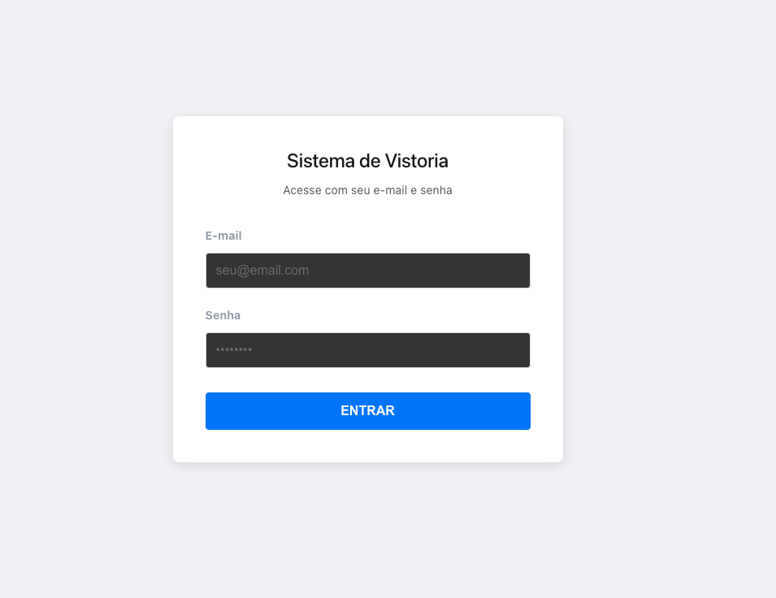
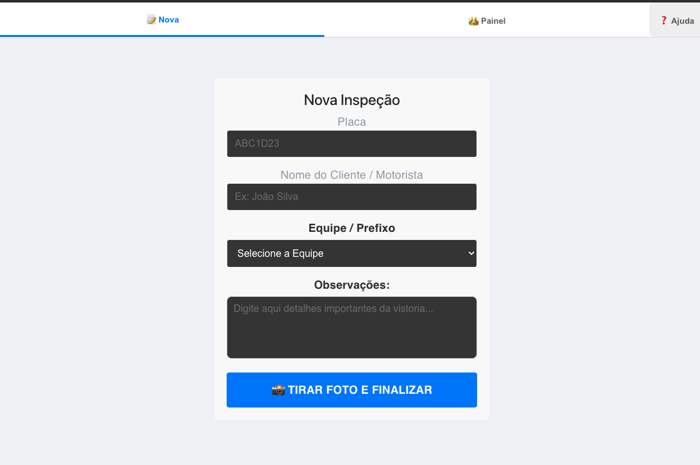

## 🇺🇸 English

### 🚚 Truck Inspection System
A robust application developed to digitize the inspection process, allowing for data logging, photo uploads, and real-time location tracking.

### 🛠️ Tech Stack
* **React + Vite:** Fast and modern frontend.
* **Supabase:** Database, Authentication, and Photo Storage.
* **Recharts:** Productivity dashboards and charts.
* **Vercel:** Hosting and Deployment with HTTPS (essential for GPS).
* **XLSX:** Exporting reports to Excel.

### 🚀 Key Features
1.  **Interactive Dashboard:** Full visualization of inspections by team.
2.  **Advanced Security (RLS):** Row Level Security protection in the database.
3.  **Geolocation:** Automatic coordinate capture (Latitude/Longitude) during inspection.
4.  **Media Upload:** Secure storage for inspection photos.
5.  **Data Export:** Generating Excel reports for auditing.

### 📋 Step-by-Step (How to use)
1.  **Login:** Access with your authorized credentials.
2.  **New Inspection:** Fill in vehicle data and take the required photos.
3.  **GPS:** The system will ask for location permission; accept to record the exact spot.
4.  **Dashboards:** Track productivity charts on the main panel.
5.  **Report:** Click the export button to download the data spreadsheet.

### 🌐 From Scratch to Deploy
1.  **Development:** Started with Vite and integrated with Supabase via environment variables.
2.  **Database Setup:** Table creation and activation of security policies (RLS).
3.  **Hosting:** Project connected to GitHub and deployed on Vercel.
4.  **Build Tuning:** Configured the build script to read dynamic variables, ensuring secure API connection.

---
## 🇧🇷 Português

### 🚚 Sistema de Vistoria de Caminhões
Um aplicativo robusto desenvolvido para digitalizar o processo de vistoria, permitindo o registro de dados, fotos e localização em tempo real.

### 🛠️ Ferramentas Utilizadas
* **React + Vite:** Interface rápida e moderna.
* **Supabase:** Banco de Dados, Autenticação e Storage de fotos.
* **Recharts:** Dashboards e gráficos de produtividade.
* **Vercel:** Hospedagem e Deploy com HTTPS (essencial para o GPS).
* **XLSX:** Exportação de relatórios para Excel.

### 🚀 O que foi feito
1.  **Dashboard Interativo:** Visualização total das vistorias realizadas por equipe.
2.  **Segurança Avançada (RLS):** Proteção de dados a nível de linha no banco de dados.
3.  **Geolocalização:** Captura automática de coordenadas (Latitude/Longitude) no momento da vistoria.
4.  **Upload de Mídia:** Armazenamento seguro de fotos das vistorias.
5.  **Exportação de Dados:** Geração de relatórios Excel para auditoria.

### 📋 Passo a Passo (Uso)
1.  **Login:** Acesse com suas credenciais autorizadas.
2.  **Nova Vistoria:** Preencha os dados do veículo e tire as fotos necessárias.
3.  **GPS:** O sistema solicitará permissão de localização; aceite para registrar o local exato.
4.  **Dashboards:** No painel principal, acompanhe os gráficos de produtividade.
5.  **Relatório:** Clique no botão de exportar para baixar a planilha de dados.

### 🌐 Do Início ao Deploy
1.  **Desenvolvimento:** Iniciado com Vite e integrado ao Supabase via variáveis de ambiente.
2.  **Configuração de Banco:** Criação de tabelas e ativação das políticas de segurança (RLS).
3.  **Hospedagem:** O projeto foi conectado ao GitHub e deployado na Vercel.
4.  **Ajuste de Build:** Configurado o script de build para ler variáveis dinâmicas, garantindo a conexão segura com a API.

---

